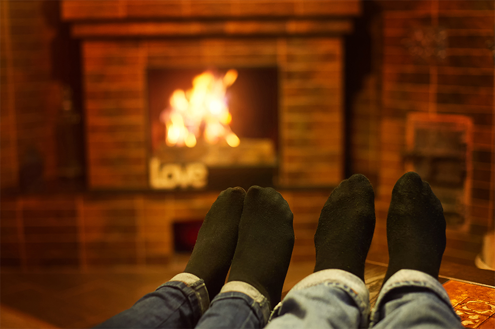

Another day has passed by on this army post and as I relax by the makeshift fire that Chace has created for us, I find myself reflecting on life and happiness. What, to each of us, is a happy life? For Chace and I, a lot things make up a happy life, but the epitome of happiness really comes down to moments like this. Contentment.

We spent our day today as a family, doing chores, shopping, and putting up halloween decorations. Sticking sparkly glitter spiders all over our windows and pouring five pounds of candy into a large bowl for trick-or-treaters while our daughters and our neighbor's children gathered around holding out their adorably chubby little hands for a piece. Chace swept the driveway while I hung up bright orange twinkle lights that illuminate our entry hall, casting a warm glow over our front yard to entice little trick-or-treaters.

We ate leftovers of the giant 'cauldron' of homemade chili that I had made yesterday for lunch and had meatloaf and mashed potatoes for dinner. The only place we went was to the exchange to get Chace a new pair of shoes and a few candles for the house. The weather was warm with a mild breeze and was perfect to let the kids ride their bikes while we picked up the yard and watched over them. We happily did the chores that we save for the weekend, taking pride in our home and everything that we've built so far as a family while preparing for a busy and festive week.

Today, in short, was a beautiful and content day. Now, as the children are fed and bathed and fast asleep in their beds, Chace and I are contentedly relaxing in our clean, warm home. Our bellies full and our hands and feet warm, our souls are content and happy. This is what we do it all for. These sweet, warm, lovely moments. There is nothing like it. While we love the adventurous parts of life , and the competition, and we even embrace the sorrowful days, these are the moments we truly cherish. Normal, happy days with our beautiful children, our wonderful neighbors, and the warm nights in each other's arms. As the great Ernest Hemingway (who, notably, is from our home state of Idaho) once wrote, "We ate well and cheaply, and drank well and cheaply, and slept well and warm together and loved each other". This is a beautiful life.
